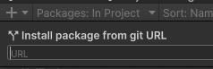

Unity Asset Dependency Viewer
===

About Unity Asset Dependency Viewer
---
A viewer for checking asset dependencies, based on **DependencyViewer** from [**com.unity.search.extensions**](https://github.com/Unity-Technologies/com.unity.search.extensions).

Designed to work with unity 2023 or later.

Asset Dependency Viewer Window
---
You can open window from [Window -> Asset Dependency Viewer].

The window where you can check Uses and Used of selecting asset.

The Update button must be pressed to capture the current asset dependency state first.

The ProjectView displays the Used Count for each asset.

Modifier key
--- 

Key down on uses/used asset item with control key, you can select asset in direct. 

UPM
--- 
**https://github.com/yassy0413/UnityAssetLauncher.git**

You can install from Package Manager.

